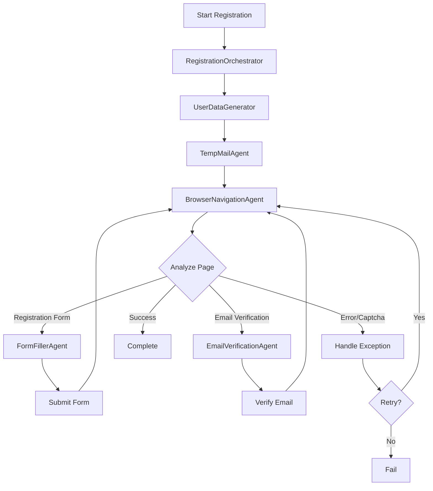

# 🏗️ Архитектура мульти-агентной системы регистрации

## 📋 Обзор системы

Система состоит из специализированных агентов, каждый из которых отвечает за свою область задач. Все агенты координируются через главный оркестратор.

## 🎭 Агенты системы

### 1. RegistrationOrchestrator (Главный координатор)
**Файл:** `orchestrator.py`

**Ответственность:**
- Координация всех агентов
- Управление состоянием процесса регистрации
- Принятие решений о следующих шагах
- Обработка ошибок и повторных попыток
- Логирование всего процесса

**Основные методы:**
```python
class RegistrationOrchestrator:
    async def start_registration(referral_link: str)
    async def coordinate_agents()
    async def handle_page_change()
    async def decide_next_action()
    async def handle_errors()
    async def save_registration_results()
```

**Взаимодействие:**
- Использует BrowserNavigationAgent для анализа страниц
- Вызывает FormFillerAgent для заполнения форм
- Координирует TempMailAgent и EmailVerificationAgent
- Использует UserDataGenerator для получения данных

---

### 2. TempMailAgent (Управление временной почтой)
**Файл:** `temp_mail_agent.py`

**Ответственность:**
- Создание временных email адресов
- Проверка входящих писем
- Извлечение ссылок подтверждения
- Парсинг кодов верификации

**Основные методы:**
```python
class TempMailAgent:
    async def create_temp_email() -> str
    async def check_inbox(email: str) -> List[Email]
    async def get_verification_link(email: str) -> str
    async def get_verification_code(email: str) -> str
    async def wait_for_email(email: str, timeout: int)
```

**Используемые сервисы:**
- temp-mail.org API
- 10minutemail.com
- guerrillamail.com

---

### 3. FormFillerAgent (Заполнение форм)
**Файл:** `form_filler_agent.py`

**Ответственность:**
- Анализ полей формы через Gemini
- Определение типа каждого поля
- Интеллектуальное заполнение данных
- Обработка различных типов полей (select, radio, checkbox)
- Валидация заполненных данных

**Основные методы:**
```python
class FormFillerAgent:
    async def analyze_form(page_screenshot) -> FormAnalysis
    async def fill_text_field(page, selector, value)
    async def select_dropdown(page, selector, value)
    async def handle_radio_buttons(page, name, value)
    async def handle_checkboxes(page, selectors)
    async def submit_form(page)
```

**Типы обрабатываемых полей:**
- Текстовые поля (email, password, name, phone)
- Выпадающие списки (country, language, timezone)
- Радио-кнопки (gender, account type)
- Чекбоксы (terms, newsletter, preferences)
- Даты (birthdate)
- Файлы (avatar upload)

---

### 4. BrowserNavigationAgent (Навигация и анализ)
**Файл:** `browser_navigation_agent.py`

**Ответственность:**
- Управление браузером через Playwright
- Создание скриншотов для анализа
- Определение типа текущей страницы
- Обнаружение и обход защит (captcha, rate limiting)
- Управление cookies и сессиями

**Основные методы:**
```python
class BrowserNavigationAgent:
    async def navigate_to(url: str)
    async def analyze_current_page() -> PageAnalysis
    async def detect_page_type() -> PageType
    async def handle_popups()
    async def bypass_cookie_banner()
    async def detect_captcha() -> CaptchaInfo
    async def wait_for_navigation()
```

**Обрабатываемые сценарии:**
- Многошаговая регистрация
- Модальные окна и попапы
- Cookie баннеры
- Редиректы
- AJAX загрузка контента
- Капчи (уведомление пользователя)

---

### 5. EmailVerificationAgent (Подтверждение email)
**Файл:** `email_verification_agent.py`

**Ответственность:**
- Ожидание писем с подтверждением
- Переход по ссылкам активации
- Ввод кодов подтверждения
- Обработка различных типов верификации

**Основные методы:**
```python
class EmailVerificationAgent:
    async def wait_for_verification_email(email: str)
    async def click_verification_link(link: str)
    async def enter_verification_code(page, code: str)
    async def handle_email_resend()
    async def verify_email_confirmed()
```

---

### 6. UserDataGenerator (Генерация данных)
**Файл:** `user_data_generator.py`

**Ответственность:**
- Генерация реалистичных данных пользователя
- Поддержка различных локалей
- Генерация валидных номеров телефонов
- Создание уникальных username
- Генерация безопасных паролей

**Основные методы:**
```python
class UserDataGenerator:
    def generate_user_profile() -> UserProfile
    def generate_username(base: str) -> str
    def generate_password(requirements: PasswordReqs) -> str
    def generate_phone(country: str) -> str
    def generate_address(country: str) -> Address
    def generate_company_info() -> CompanyInfo
```

---

## 🔄 Поток работы системы



---

## 📊 Обработка различных сценариев

### 1. Простая регистрация
- Одна страница с формой
- Email и пароль
- Прямое подтверждение

### 2. Многошаговая регистрация
- Шаг 1: Email/пароль
- Шаг 2: Личные данные
- Шаг 3: Предпочтения
- Шаг 4: Подтверждение

### 3. OAuth регистрация
- Выбор провайдера (Google, Facebook)
- Дополнительные данные
- Связывание аккаунтов

### 4. Корпоративная регистрация
- Данные компании
- Выбор тарифного плана
- Платежная информация (пропуск)

### 5. Защитные механизмы
- Капча → уведомление пользователя
- Rate limiting → задержки между действиями
- Phone verification → использование сервисов SMS
- Email domain check → использование разрешенных доменов

---

## 🛠️ Технические детали

### Используемые технологии:
- **Playwright** - управление браузером
- **Google Gemini** - анализ страниц и принятие решений
- **asyncio** - асинхронная работа
- **Временная почта API** - создание email адресов
- **Faker** - генерация реалистичных данных

### Структура данных:

```python
@dataclass
class PageAnalysis:
    page_type: PageType
    forms: List[FormInfo]
    required_actions: List[Action]
    obstacles: List[Obstacle]
    next_step_prediction: str

@dataclass
class UserProfile:
    email: str
    password: str
    username: str
    first_name: str
    last_name: str
    phone: str
    birthdate: str
    country: str
    preferences: Dict[str, Any]

@dataclass
class RegistrationResult:
    success: bool
    account_created: bool
    email_verified: bool
    credentials: Dict[str, str]
    errors: List[str]
    screenshots: List[str]
```

---

## 📁 Структура файлов проекта

```
Проект AgentScope/
├── main.py                    # Точка входа
├── orchestrator.py           # Главный координатор
├── agents/
│   ├── __init__.py
│   ├── browser_navigation_agent.py
│   ├── form_filler_agent.py
│   ├── temp_mail_agent.py
│   ├── email_verification_agent.py
│   └── user_data_generator.py
├── models/
│   ├── __init__.py
│   ├── page_analysis.py
│   ├── user_profile.py
│   └── registration_result.py
├── utils/
│   ├── __init__.py
│   ├── gemini_client.py
│   ├── logger.py
│   └── validators.py
├── config.py
├── requirements.txt
├── .env
└── README.md
```

---

## 🔮 Будущие улучшения

1. **Машинное обучение**
   - Обучение на успешных регистрациях
   - Предсказание следующих шагов
   - Оптимизация заполнения форм

2. **Поддержка большего количества сценариев**
   - 2FA аутентификация
   - Биометрическая верификация
   - KYC процессы

3. **Интеграции**
   - API для массовой регистрации
   - Webhook уведомления
   - Экспорт данных в CRM

4. **Безопасность**
   - Шифрование сохраненных данных
   - Безопасное хранение паролей
   - Аудит логи

---

## ⚙️ Конфигурация

```python
# config.py
REGISTRATION_CONFIG = {
    "max_retries": 3,
    "page_load_timeout": 30000,
    "element_timeout": 5000,
    "email_check_interval": 10,
    "email_wait_timeout": 300,
    "screenshot_on_error": True,
    "headless_mode": False,
    "user_agent": "Mozilla/5.0...",
    "viewport": {"width": 1920, "height": 1080}
}
```
